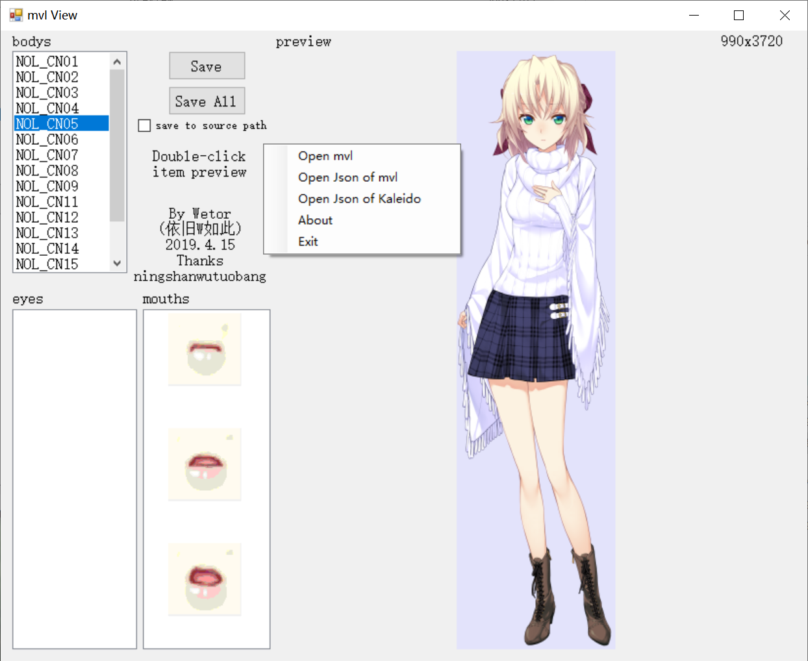

# mvl_preview
MAGES Engine mvl file(characters' tachie picture) preview tool, also works for Kaleido ADV Workshop engine by MAGES.  
Compatible games list of MAGES Engine [\[VNDB\]](https://vndb.org/r?q=&o=d&s=released&f=02fwMAGES_e_0Engine-72_0bUKQ)(only releases after 2016), Kaleido ADV Workshop [\[VNDB\]](https://vndb.org/r?q=&o=a&s=title&f=02fwKaleido_0ADV_0Workshop-N6830Ox)(only releases by MAGES).  
  
_Memories Off Innocent Fille Noelle Fullbloom_ (switch version)  
**Some characters do not have eye difference, it's normal as it is.**
# How to use
You need to install [.NET Framework Runtime](https://dotnet.microsoft.com/en-us/download/dotnet-framework/net461) 4.6.1 or higher.  
Alternatively, you can try .NET6 release with [.NET 6 Desktop Runtime](https://dotnet.microsoft.com/en-us/download/dotnet/6.0), which may only works on Win10/Win11 and may have unknown issues.  
## users for MAGES Engine games
1, Get the mvl files from game archives, usually in chara.cpk, chara.mpk, or chara folder. You can open cpk/mpk with [GARbro](https://github.com/morkt/GARbro).  
2, Open the program, right-click the "bodys" listbox, select "Open mvl" to open the mvl file, or just drag and drop it onto the window.  
3, Wait about 10 seconds for processing, it depends on your CPU, and then enjoy it.  
4, Exit with the button in right-click menu to clear temp files in temp folder, usually C:\Windows\Temp or ％AppData％\Local\Temp.  
## users for Kaleido ADV Workshop games
1, Decompile "image_info.psb.m" with [FreeMote](https://github.com/UlyssesWu/FreeMote), usually use "PsbDecompile info-psb -k \*thedecryptkey\* image_info.psb.m -a".  
2, Open the program, right-click the "bodys" listbox, select "Open Json of Kaleido" to open the "chara_hash123456.psb.m.json" file (not the resx.json file), or just drag and drop it onto the window. Then the same as mvl.  
## command line user
Run with "mvlview.exe \[\*.json\]" or "mvlview.exe \[\*.mvl\]", or just drag and drop the files on EXE. It will generate all images in the working directory. It will not work for other extensions.  
You can also use "-o \[\*.json\/*.mvl\]" to open this file in the form.  
## old versions or got exceptions
1, Use mvl.py in this project [ChaosChildPCTools](https://github.com/ningshanwutuobang/ChaosChildPCTools) \(or [Here](https://github.com/manicsteiner/ChaosChildPCTools) for updated version\) , you will get some fragmented PNG files and a JSON file.  
2, Open the program, right-click the "bodys" listbox, select "Open Json of mvl" to open the JSON file.  
3, Enjoy!  