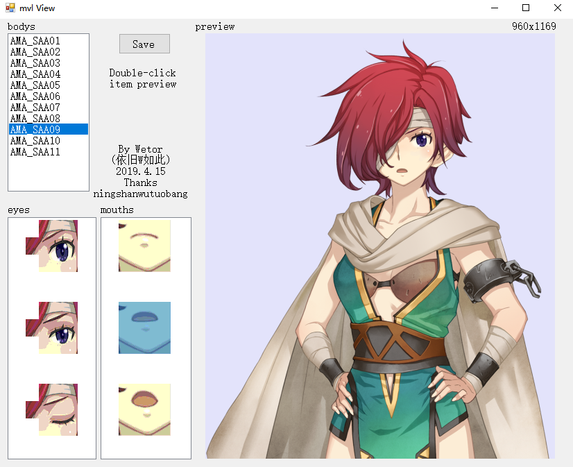

# mvl_preview
mages engine mvl file(characters picture)preview tool  
  
yu-no (switch version)  
# How to use
## basic users
1,Open the program, right-click the "bodys" listbox, select "open mvl" to open the mvl file.  
2,Wait for about 30 seconds, and then enjoy it.  
3,Exit with the button in right-click menu to clear temp files in C:\Windows\Temp.  
## command line user
Run with "mvlview.exe \[\*.json\]" or "mvlview.exe \[\*.mvl\]". It will generate all images in the working directory. It will not work for other extensions.  
## old versions or got exceptions
1,Use mvl.py in this project [ChaosChildPCTools](https://github.com/ningshanwutuobang/ChaosChildPCTools) \(or [Here](https://github.com/manicsteiner/ChaosChildPCTools) for updated version\) , you will get some fragmented PNG files and a JSON file.  
2,Open the program, right-click the "bodys" listbox, select "open json" to open the JSON file.  
3,enjoy!  